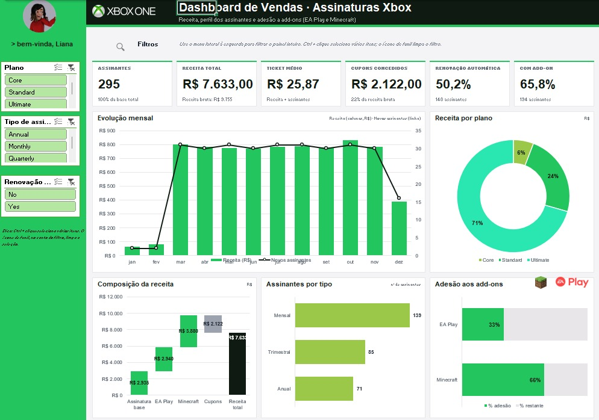

# 🎮 Dashboard de Vendas — Assinaturas Xbox

Dashboard interativo em Excel que transforma uma base de 295 assinaturas em respostas rápidas: **quanto entrou, de quais planos, em quais meses e com quais add-ons**. Um menu lateral com segmentações de dados permite filtrar tudo com um clique, e o painel inteiro se atualiza.



## O que o painel mostra

| Bloco | Conteúdo |
|---|---|
| **Indicadores** | Assinantes, receita total, ticket médio, cupons concedidos, % de renovação automática e % de assinantes com add-on |
| **Evolução mensal** | Receita por mês (colunas) e novos assinantes (linha) |
| **Receita por plano** | Participação de Core, Standard e Ultimate na receita |
| **Composição da receita** | Cascata: assinatura base + EA Play + Minecraft − cupons = receita total |
| **Assinantes por tipo** | Mensal, trimestral e anual |
| **Adesão aos add-ons** | % de assinantes com EA Play e com Minecraft |
| **Top 5 assinantes** | Maiores valores totais (desempate pelo menor ID) |
| **Destaques** | Plano, mês, tipo de assinatura e add-on líderes |

**Menu lateral (segmentações de dados):** Plano, Tipo de assinatura e Renovação automática. Eles afetam todos os blocos acima. Use **Ctrl + clique** para selecionar vários itens e o ícone de funil para limpar o filtro.

## Principais achados (base completa)

- **295 assinantes** geraram **R$ 7.633,00** de receita (ticket médio de **R$ 25,87**).
- O plano **Ultimate** concentra **71%** da receita (R$ 5.388) com ~1/3 dos assinantes; o **Core** responde por apenas **6%**.
- Os add-ons pesam: EA Play (R$ 2.940) e Minecraft (R$ 3.880) somam mais que a assinatura base (R$ 2.935).
- **Cupons** somam R$ 2.122, ou **22%** da receita bruta (R$ 9.755).
- **66%** dos assinantes contrataram Minecraft e **33%**, EA Play; **66%** têm ao menos um add-on.
- Jan e fev têm só 2 novos assinantes cada; de **mar a nov** o ritmo se estabiliza em ~30 por mês. Maior receita mensal: **outubro** (R$ 832).
- **Mensal** é o tipo mais comum (139 assinantes, 47%) e **50%** têm renovação automática.

## Dados

Arquivo: [`dados/Base.xlsx`](dados/Base.xlsx) — aba **Bases**, tabela `Tabela1`, 295 linhas e 13 colunas.

| Coluna | Descrição |
|---|---|
| Subscriber ID / Name | Identificador e nome do assinante |
| Plan | Core, Standard ou Ultimate |
| Start Date | Data de início (jan–dez/2024) |
| Auto Renewal | Renovação automática (Yes/No) |
| Subscription Price | Preço do plano |
| Subscription Type | Monthly, Quarterly ou Annual |
| EA Play Season Pass / Price | Contratou EA Play? e o valor |
| Minecraft Season Pass / Price | Contratou Minecraft? e o valor |
| Coupon Value | Desconto aplicado |
| Total Value | Assinatura + EA Play + Minecraft − cupom |

**Validações feitas:** sem células vazias, IDs únicos e `Total Value` conferido linha a linha com a soma dos componentes (295 de 295 corretas). Há nomes repetidos com IDs diferentes; tratei o **Subscriber ID** como identificador único.

## Estrutura do arquivo Excel

- **Assets** — paleta de cores e logos.
- **Bases** — dados brutos em tabela do Excel, mais a coluna auxiliar `Visível` (`=SUBTOTAL(103,…)`), que vale 1 nas linhas que passam pelas segmentações.
- **Cálculos** — todas as fórmulas (`COUNTIFS`, `SUMIFS`, `INDEX/MATCH`, `LARGE`, `EDATE`), organizadas em blocos numerados, com uma linha de conferência (cascata fecha em 0).
- **Dashboard** — painel final, com filtros e gráficos nativos do Excel.

As colunas da base têm **nomes definidos** (`Base_Plano`, `Base_Total`, `Base_Inicio` etc.), o que deixa as fórmulas legíveis, por exemplo:

```excel
=SUMIFS(Base_Total, Base_Plano, "Ultimate", Base_Tipo, "Monthly")
```

## Como reproduzir

1. Abra `Dashboard_Assinaturas_Xbox.xlsx` no Excel (2019 ou Microsoft 365). Se abrir em *Modo de Exibição Protegido*, clique em **Habilitar Edição**.
2. Vá à aba **Dashboard** e clique nos itens do menu lateral verde. As segmentações exigem **Excel 2013 ou superior** (no Excel Online e no LibreOffice não funcionam).
3. Para usar **outra base**: cole os novos dados na tabela da aba **Bases** (mesmas colunas e ordem). Se houver mais de 295 linhas, estenda os nomes definidos em *Fórmulas › Gerenciador de Nomes*, a coluna `Visível` e o bloco auxiliar da coluna N em **Cálculos**.
4. Para refazer do zero a partir de `dados/Base.xlsx`: crie a aba de cálculos com os blocos descritos acima, os gráficos a partir deles. Para os filtros: selecione uma célula da tabela, vá em *Inserir › Segmentação de Dados* e marque Plan, Subscription Type e Auto Renewal.

## Decisões de design

- **Segmentações na própria tabela** (sem tabelas dinâmicas): as fórmulas contam só as linhas visíveis, então nada precisa ser atualizado manualmente.
- **Paleta Xbox** (verdes `#9BC848`, `#22C55E`, `#2AE6B1`, `#5BF6A8`) e cinza neutro `#E8E6E9`.
- Gráficos nativos do Excel, sem macros nem dependências externas.

## Estrutura do repositório

```
dashboard-vendas-xbox/
├── Dashboard_Assinaturas_Xbox.xlsx
├── dados/Base.xlsx
├── docs/preview.png
├── README.md
```
